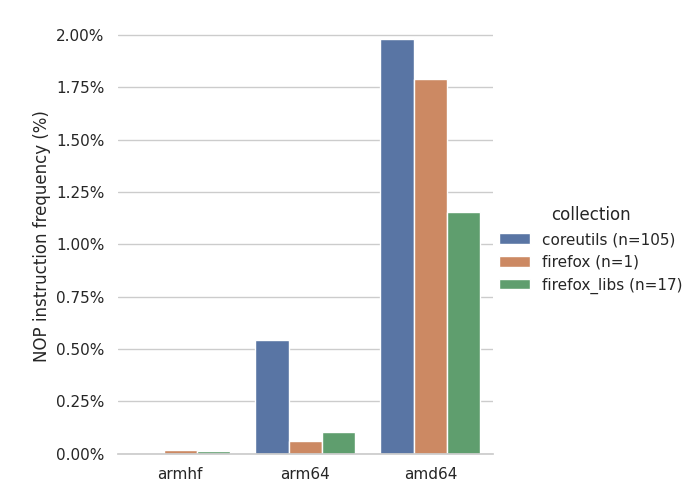

# NOP Instruction Frequency Analysis and Text Segment Sizes on x86, ARMv7, and ARMv8

This investigates whether two techniques would be applicable on ARM:
- Using NOP padding instructions as free space to add tracepoint handlers
- Using relative branch instructions for single-instruction tracepoints, which have a maximum range of 32 MB, to jump outside of the text segment space

## Prerequisites

- [Python 3](https://www.python.org/downloads/)
- Pip packages:
    - [Capstone](http://www.capstone-engine.org/documentation.html): `sudo pip3 install capstone`
    - [Seaborn](https://seaborn.pydata.org/): `pip3 install seaborn`
    - [Pandas](https://pandas.pydata.org/pandas-docs/stable/index.html): `pip3 install pandas`

## Setup

Place binaries to analyse in the `binaries` directory, with subdirectories named for each architecture. For example:

```
binaries
├── coreutils
│   ├── amd64
│   │   └── <binaries>
│   ├── arm64
│   │   └── <binaries>
│   └── armhf
│       └── <binaries>
├── firefox
│   ├── amd64
│   │   └── <binaries>
│   ├── arm64
│   │   └── <binaries>
│   └── armhf
│       └── <binaries>
└── firefox_libs
    ├── amd64
    │   └── <binaries>
    ├── arm64
    │   └── <binaries>
    └── armhf
        └── <binaries>
```

## Usage

### Generate NOP instruction frequency graph

```
./main.py
```

### Analyze text segment sizes to check for < 32 MB limit for ARM jumps

```
size -B **/arm64/* > arm64-sizes.txt
size -B **/armhf/* > armhf-sizes.txt
```

## Methodology

The analyzed binaries are the release builds of binaries from the GNU Coreutils, Firefox, and cross-arch Firefox shared objects. These were extracted from the Ubuntu 18.04 `.deb` packages meant for the ARMv7 (armhf), ARMv8 (arm64), and x86 (amd64) architectures.

The Capstone library was then used to disassemble each binary, count the total number of non-data instructions and calculate the percentage of NOP instructions. Even though data sections of the ELF were avoided by Capstone, it is possible that certain non-text segments may have been included in the analysis. This may sometimes appear as `add` instructions on ARM, for instance, which reduces the percentage of NOP instructions. However, the raw number of NOP instructions remains much lower on ARMv8 (and is near 0 for ARMv7) when compared to x86.

## Results

### NOP instruction frequency

NOP instructions are much less common in ARMv7 (armhf) and ARMv8 (arm64) binaries when compared to their x86 (amd64) counterparts. The figure below shows the average percentage of NOP instructions for binaries of each architecture.



The exact number of NOP instructions for each binary can be found in the `nop-analysis-output.txt` file.

Since the frequency of NOP instructions is much smaller on ARM than on x86, techniques based on the use of NOP instructions to add tracepoint handlers (such as Anas Balboul's NOProbe) seem ill-suited for ARM.

### Text segment sizes

Some of the researched instrumentation techniques for ARM tracepoints involve using a relative branch to jump to a probe handler. However, relative branch instructions on ARM have a maximum range of 32 MB. If the tracepoint handling trampoline is located in free space outside of the text segment, this means a technique using relative branching would fail for text segments of sizes 64 MB or greater. This is because the trampoline could in theory be just before or after the text segment, and as thus a tracepoint in the middle of the text segment could jump 32 MB lower or higher in the address space, for a maximum text segment size of 2 * 32 MB = 64 MB.

To investigate if this limitation would be an issue in practice, the text segment sizes of different binaries were also analyzed. This was done by querying the ELF information using the `size -B` command. The results of ARMv8 and ARMv7 text sizes can be found in the `arm64-sizes.txt` and `armhf-sizes.txt` files, respectively. The text segment size (in bytes) is always smaller than 32 MB for the analyzed binaries. However, using the same command on very large programs such as Chromium can yield text segment sizes in excess of 64 MB.

This means that the relative branch technique can indeed work in a number of cases provided the binary sizes are reasonable. For very large monolithic binaries, however, the technique may not be suitable.
